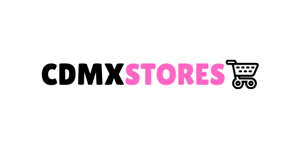

*Visualiza nuestra aplicación en el siguiente enlace:*

[*CDMX STORES*](https://mapbox-with-react.firebaseapp.com/)

##  ¿ Qué es CDMX STORES? 📍

[*CDMX STORES*](https://mapbox-with-react.firebaseapp.com/)   Es una plataforma que permite al usuario visualizar un total de 273 tiendas dentro del Mapa de Ciudad de México .

## Creación del proyecto 🚀

 Este proyecto es un respuesta el code challengue, a este
 [Reto](https://github.com/digital-generation/generation-take-home-intern).

 
 Historias de usuarios : 
        <ul>
          <li> Como estudiante, quiero ver un mapa de <b> Ciudad de México </b> </li>
          <li> Como estudiante, quiero ver un mapa que tenga <b> todas las tiendas </b> representadas como <b> marcadores / pines </b> en el mapa.  </li>
          <li> Como estudiante, quiero poder hacer clic en el marcador de una tienda y agregarlo a una lista de <b> ' Mis tiendas favoritas ' </b> </li>
          <li> Como estudiante, quiero poder hacer clic en una tienda en  ' Mis tiendas favoritas '  y eliminarla de la lista </ul>

### Planificación 📌

La planificación dada al reto en poco tiempo ! Se hizo en *projects* de GitHub .Si quieres saber como fue el proceso de planificación lo puedes ver [*aquí*](https://github.com/luisaromero/mapbox-with-react/projects/1)

### Tecnologías usadas para la creación de Burguer Queen 🔧

- Para esta plataforma se usó la biblioteca de programación de javascript [React](https://es.wikipedia.org/wiki/React) versión 16.0.6

- Para el obtener y mostrar el mapa de Ciudad de Mexico se usó la API de [Mapbox](https://www.mapbox.com/)

### Gracias por visitar mi proyecto !! 🎁
 ##### Con ❤️ [Luisa Romero](https://github.com/luisaromero) 🦋

